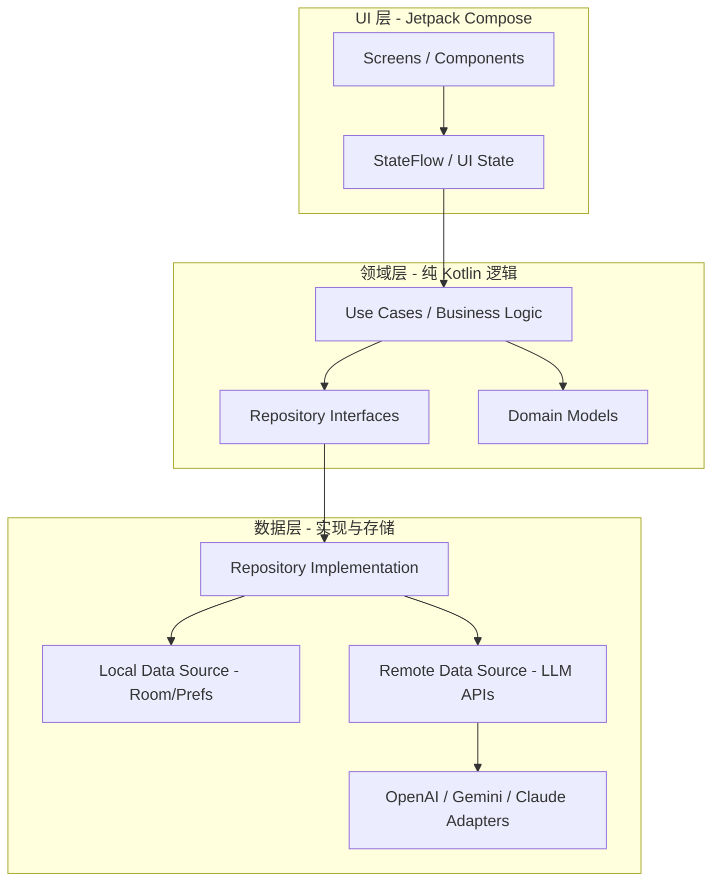

# Android LLM 对话客户端 - 技术设计文档

> **版本**: 1.3.0
> **更新日期**: 2026-01-07
> **状态**: 设计阶段

---

## 目录
1. [系统架构设计](#1-系统架构设计-system-architecture)
2. [API 格式规范与统一抽象](#2-api-格式规范与统一抽象-api-specifications)
3. [数据模型设计](#3-数据模型设计-data-models)
4. [功能模块详细设计](#4-功能模块详细设计-feature-modules)
   - 4.1 [渠道管理模块](#41-渠道管理模块-channel-management)
   - 4.2 [消息编辑与分支功能](#42-消息编辑与分支功能-message-edit--branch)
   - 4.3 [思维链处理](#43-思维链处理-reasoningthinking)
   - 4.4 [流式响应控制](#44-流式响应控制-streaming-control)
   - 4.5 [多模态输入](#45-多模态输入-multimodal-input)
   - 4.6 [AI 图片生成](#46-ai-图片生成-image-generation)
   - 4.7 [消息渲染](#47-消息渲染-message-rendering)
5. [前后端接口规范](#5-前后端接口规范-ai-collaboration-specs)
6. [技术栈与关键依赖](#6-技术栈与关键依赖-tech-stack)

---

## 1. 系统架构设计 (System Architecture)

基于高性能、易维护、易重构前端、安全的原则，本程序采用 **Clean Architecture (整洁架构)** 结合 **MVVM** 模式。

### 1.1 分层设计



### 1.2 核心解耦策略
- **UI 与逻辑完全解耦**：Domain 层不包含任何 Android 框架代码。UI 层（Compose）仅观察 ViewModel 暴露的状态。
- **Provider 适配器模式**：通过统一的 `LLMProvider` 接口屏蔽 OpenAI、Gemini 和 Claude 之间的协议差异。
- **依赖注入**：使用 Hilt 管理各层之间的依赖，方便后期替换具体实现（如从 OpenAI 切换到本地模型）。

---

## 2. API 格式规范与统一抽象 (API Specifications)

### 2.1 统一 Provider 抽象接口
为了处理三方 API 的巨大差异，我们在 Domain 层定义统一的接口：

```kotlin
interface LLMProvider {
    val id: ProviderId
    val capabilities: ProviderCapabilities

    // 对话接口 (流式)
    fun streamChat(
        request: UnifiedChatRequest,
        config: ChannelConfig
    ): Flow<StreamEvent>

    // 图片生成接口
    suspend fun generateImage(
        prompt: String,
        options: ImageOptions,
        config: ChannelConfig
    ): Result<ImageResult>
}
```

### 2.2 三方格式对比与适配方案

| 特性 | OpenAI (OAI) | Google Gemini | Anthropic Claude |
| :--- | :--- | :--- | :--- |
| **认证头** | `Authorization: Bearer` | `x-goog-api-key` | `x-api-key` |
| **消息结构** | `messages` 数组 | `contents/parts` 结构 | `messages` 数组 |
| **系统提示词** | Role: `system` 消息 | `systemInstruction` 字段 | 独立 `system` 字段 |
| **流式格式** | SSE (`data: {json}`) | 独立流式端点 | SSE (`event` + `data`) |
| **生图支持** | DALL-E 3 / gpt-image-1 | Native (2.0 Flash) | 不支持 |

### 2.3 流式解析器 (Stream Parser)

各 Provider 的流式响应格式不同，需使用对应的解析器：

| Provider | 流式格式 | 终止标记 | 说明 |
|----------|---------|---------|------|
| OpenAI | SSE | `data: [DONE]` | `data: {json}` 格式 |
| Claude | SSE | `event: message_stop` | 带 `event:` 类型 |
| Gemini | NDJSON/分块 JSON | 无特殊标记 | 行分隔 JSON，非 SSE |

**OpenAI SSE 格式**：
```
data: {"choices":[{"delta":{"content":"Hello"}}]}
data: {"choices":[{"delta":{"content":" world"}}]}
data: [DONE]
```

**Claude SSE 格式**：
```
event: message_start
data: {"type":"message_start","message":{...}}

event: content_block_delta
data: {"type":"content_block_delta","delta":{"text":"Hello"}}

event: message_stop
data: {"type":"message_stop"}
```

**Gemini NDJSON 格式**（⚠️ 非 SSE）：
```json
{"candidates":[{"content":{"parts":[{"text":"Hello"}]}}]}
{"candidates":[{"content":{"parts":[{"text":" world"}]}}]}
```

**注意**：使用 `?alt=sse` 参数时 Gemini 会返回 SSE 格式，否则返回 NDJSON。

---

## 3. 数据模型设计 (Data Models)

全部数据存储在本地 Room 数据库中，敏感信息（API Key）存储在 EncryptedSharedPreferences。

### 3.1 数据库表结构 (Room Entities)

#### 渠道配置 (Channels)
存储 API 端点、模型参数和自定义 Header。
```kotlin
@Entity(tableName = "channels")
data class ChannelEntity(
    @PrimaryKey val id: String,
    val name: String,
    val providerType: ProviderType,     // OPENAI, GEMINI, CLAUDE
    val baseUrl: String,
    val apiKeyRef: String,              // 别名，用于从加密存储检索 Key
    val customHeadersJson: String?,     // Map<String, String> 的 JSON
    val proxyType: ProxyType,           // NONE, HTTP, SOCKS5
    val proxyHost: String?,
    val proxyPort: Int?,
    val defaultModelId: String?,        // 默认选中的模型 ID
    val streamEnabled: Boolean,         // 是否启用流式响应
    val createdAt: Long,
    val updatedAt: Long
)
```

#### 模型配置 (Models)
通过 `/v1/models` API 获取的模型列表，支持单独配置每个模型的能力参数。
```kotlin
@Entity(
    tableName = "models",
    foreignKeys = [ForeignKey(
        entity = ChannelEntity::class,
        parentColumns = ["id"],
        childColumns = ["channelId"],
        onDelete = ForeignKey.CASCADE
    )],
    indices = [Index("channelId")]
)
data class ModelEntity(
    @PrimaryKey val id: String,         // 模型 ID，如 "gpt-4o", "claude-sonnet-4-5-20241022"
    val channelId: String,              // 所属渠道
    val displayName: String,            // 显示名称（可自定义）
    val contextLength: Int,             // 上下文窗口大小 (tokens)
    val maxOutputTokens: Int,           // 最大输出 tokens
    val supportsVision: Boolean,        // 是否支持视觉/图片输入
    val supportsImageGen: Boolean,      // 是否支持图片生成
    val supportsReasoning: Boolean,     // 是否支持推理/思维链 (o1, Claude thinking)
    val supportsStreaming: Boolean,     // 是否支持流式输出
    val defaultTemperature: Float,      // 默认温度
    val defaultTopP: Float,             // 默认 Top-P
    val isEnabled: Boolean,             // 是否启用
    val sortOrder: Int,                 // 排序顺序
    val createdAt: Long,
    val updatedAt: Long
)
```

#### 对话会话 (Conversations)
```kotlin
@Entity(
    tableName = "conversations",
    foreignKeys = [ForeignKey(
        entity = ChannelEntity::class,
        parentColumns = ["id"],
        childColumns = ["channelId"],
        onDelete = ForeignKey.CASCADE
    )],
    indices = [Index("channelId")]
)
data class ConversationEntity(
    @PrimaryKey val id: String,
    val channelId: String,              // 关联的渠道
    val modelId: String?,               // 使用的模型 (可覆盖渠道默认)
    val title: String,
    val systemPrompt: String?,
    val parentMessageId: String?,       // 分支起点消息 ID (null 表示主线)
    val rootConversationId: String?,    // 根对话 ID (用于分支追溯)
    val lastMessageTime: Long,
    val createdAt: Long
)
```

#### 消息内容 (Messages)
支持多模态内容（文字、图片、附件），支持编辑和分支。
```kotlin
@Entity(
    tableName = "messages",
    foreignKeys = [ForeignKey(
        entity = ConversationEntity::class,
        parentColumns = ["id"],
        childColumns = ["conversationId"],
        onDelete = ForeignKey.CASCADE
    )],
    indices = [Index("conversationId"), Index("parentId")]
)
data class MessageEntity(
    @PrimaryKey val id: String,
    val conversationId: String,
    val parentId: String?,              // 父消息 ID (用于分支树结构)
    val role: MessageRole,              // USER, ASSISTANT, SYSTEM
    val contentJson: String,            // List<ContentPart> 的 JSON
    val thinkingJson: String?,          // 思维链内容 (推理模型)
    val thinkingCollapsed: Boolean,     // 思维链是否折叠
    val modelUsed: String?,             // 实际响应的模型名称
    val tokenCount: Int?,               // 消息 token 数
    val isEdited: Boolean,              // 是否被编辑过
    val editedAt: Long?,                // 编辑时间
    val createdAt: Long
)
```

#### 内容块定义 (ContentPart)
```kotlin
@Serializable
sealed class ContentPart {
    @Serializable
    @SerialName("text")
    data class Text(val text: String) : ContentPart()

    @Serializable
    @SerialName("image")
    data class Image(
        val localPath: String?,         // 本地文件路径
        val base64: String?,            // Base64 数据 (二选一)
        val mimeType: String,
        val isGenerated: Boolean        // 是否为 AI 生成
    ) : ContentPart()

    @Serializable
    @SerialName("file")
    data class File(
        val localPath: String,
        val fileName: String,
        val mimeType: String,
        val extractedText: String?      // 提取的文本内容
    ) : ContentPart()
}
```

### 3.2 存储策略
- **二进制数据**（图片/原始文件）：存储在 APP 内部私有目录 `files/attachments/` 下，数据库仅存储文件路径。
- **文件附件处理**：直接将文件 Base64 编码后发送给 API，如果 API 返回错误则直接展示错误信息给用户。
- **安全性**：API Key 存储在 EncryptedSharedPreferences，利用 Android Keystore 硬件级加密。

---

## 4. 功能模块详细设计 (Feature Modules)

### 4.1 渠道管理模块 (Channel Management)

#### 4.1.1 渠道创建流程
1. 用户输入渠道名称、API 类型 (OpenAI/Gemini/Claude)、Base URL、API Key
2. 可选配置：自定义 Header、代理设置
3. 保存后自动调用 `/v1/models` 获取可用模型列表

#### 4.1.2 模型列表获取 API

各渠道类型的模型获取 API 路径和响应格式存在差异：

##### OpenAI / OpenAI 兼容渠道 (New API 等)
```http
GET {baseUrl}/v1/models
Authorization: Bearer {apiKey}
```

**响应格式**：
```json
{
  "object": "list",
  "data": [
    {
      "id": "gpt-4o",
      "object": "model",
      "created": 1686935002,
      "owned_by": "openai"
    }
  ]
}
```

##### Anthropic Claude
```http
GET {baseUrl}/v1/models?limit=100&after_id={last_id}
x-api-key: {apiKey}
anthropic-version: 2023-06-01
```

**分页参数**：
- `limit`: 每页数量 (1-1000，默认 20)
- `after_id`: 游标，获取此 ID 之后的结果
- `before_id`: 游标，获取此 ID 之前的结果

**响应格式**：
```json
{
  "data": [
    {
      "id": "claude-sonnet-4-20250514",
      "created_at": "2025-02-19T00:00:00Z",
      "display_name": "Claude Sonnet 4",
      "type": "model"
    }
  ],
  "first_id": "claude-sonnet-4-20250514",
  "has_more": true,
  "last_id": "claude-3-haiku-20240307"
}
```

**分页遍历示例**：
```kotlin
suspend fun fetchAllClaudeModels(): List<ModelInfo> {
    val allModels = mutableListOf<ModelInfo>()
    var afterId: String? = null

    do {
        val response = claudeApi.listModels(limit = 100, afterId = afterId)
        allModels.addAll(response.data)
        afterId = if (response.hasMore) response.lastId else null
    } while (afterId != null)

    return allModels
}
```

##### Google Gemini (OpenAI 兼容模式)
```http
GET {baseUrl}/v1beta/openai/models
Authorization: Bearer {apiKey}
```

**响应格式**：与 OpenAI 格式相同

##### Google Gemini (原生 API)
```http
GET {baseUrl}/v1beta/models?key={apiKey}
```

**响应格式**：
```json
{
  "models": [
    {
      "name": "models/gemini-2.5-flash",
      "displayName": "Gemini 2.5 Flash",
      "description": "...",
      "inputTokenLimit": 1048576,
      "outputTokenLimit": 8192,
      "supportedGenerationMethods": ["generateContent", "streamGenerateContent"]
    }
  ]
}
```

##### 自定义 API 路径
对于非标准渠道（如私有部署、第三方代理），用户可自定义模型获取 API 路径：

```kotlin
@Entity(tableName = "channels")
data class ChannelEntity(
    // ... 其他字段
    val modelsApiPath: String?,          // 自定义模型列表 API 路径 (如 "/api/models")
    val modelsApiMethod: String?,        // HTTP 方法 (GET/POST)
    val modelsResponseFormat: String?,   // 响应格式类型 (OPENAI/CLAUDE/GEMINI/CUSTOM)
)
```

**统一模型信息数据类**：
```kotlin
data class ModelsResponse(
    val data: List<ModelInfo>   // OpenAI/Claude 格式
    // 或 models: List<ModelInfo> for Gemini 原生格式
)

data class ModelInfo(
    val id: String,
    val displayName: String?,   // Claude: display_name, Gemini: displayName
    val created: Long?,         // Unix timestamp 或 ISO 8601
    val ownedBy: String?,
    val contextLength: Int?,    // Gemini 原生: inputTokenLimit
    val maxOutputTokens: Int?   // Gemini 原生: outputTokenLimit
)
```

#### 4.1.3 模型能力配置
获取模型列表后，用户可为每个模型单独配置：

| 配置项 | 字段名 | 说明 | 默认值 |
|--------|--------|------|--------|
| **上下文长度** | `contextLength` | 模型支持的最大上下文 tokens | 从 API 获取或手动设置 |
| **最大输出** | `maxOutputTokens` | 单次响应最大 tokens | 4096 |
| **视觉能力** | `supportsVision` | 是否支持图片输入 | false |
| **图片生成** | `supportsImageGen` | 是否支持生成图片 | false |
| **推理能力** | `supportsReasoning` | 是否支持思维链 (o1, Claude thinking) | false |
| **流式支持** | `supportsStreaming` | 是否支持流式输出 | true |
| **默认温度** | `defaultTemperature` | Temperature 参数 | 0.7 |
| **默认 Top-P** | `defaultTopP` | Top-P 采样参数 | 1.0 |

**模型能力自动检测**：
```kotlin
fun inferModelCapabilities(modelId: String): ModelCapabilities {
    return when {
        // OpenAI 视觉模型
        modelId.contains("gpt-4o") || modelId.contains("gpt-4-vision") ->
            ModelCapabilities(vision = true, streaming = true)
        // OpenAI 推理模型
        modelId.startsWith("o1") || modelId.startsWith("o3") ->
            ModelCapabilities(reasoning = true, streaming = false)
        // OpenAI 图片生成
        modelId.contains("dall-e") || modelId.contains("gpt-image") ->
            ModelCapabilities(imageGen = true, streaming = false)
        // Claude 全系列支持视觉
        modelId.contains("claude") ->
            ModelCapabilities(vision = true, reasoning = modelId.contains("thinking"), streaming = true)
        // Gemini 2.0+ 支持视觉和图片生成
        modelId.contains("gemini-2") ->
            ModelCapabilities(vision = true, imageGen = true, streaming = true)
        else -> ModelCapabilities()
    }
}
```

### 4.2 消息编辑与分支功能 (Message Edit & Branch)

#### 4.2.1 消息编辑
支持编辑用户消息和 AI 消息：

**用户消息编辑**：
- 编辑后重新发送请求
- AI 重新生成回复
- 原消息标记 `isEdited = true`

**AI 消息编辑**：
- 直接修改 AI 回复内容
- 标记 `isEdited = true`，记录 `editedAt` 时间戳
- 不触发重新生成

```kotlin
// 消息编辑逻辑
suspend fun editMessage(messageId: String, newContent: List<ContentPart>) {
    val message = messageDao.getById(messageId)

    when (message.role) {
        MessageRole.USER -> {
            // 更新消息内容
            messageDao.update(message.copy(
                contentJson = Json.encodeToString(newContent),
                isEdited = true,
                editedAt = System.currentTimeMillis()
            ))
            // 删除该消息之后的所有消息
            messageDao.deleteAfter(message.conversationId, message.createdAt)
            // 重新发送请求
            chatRepository.regenerateFromMessage(messageId)
        }
        MessageRole.ASSISTANT -> {
            // 仅更新内容，不重新生成
            messageDao.update(message.copy(
                contentJson = Json.encodeToString(newContent),
                isEdited = true,
                editedAt = System.currentTimeMillis()
            ))
        }
        else -> throw IllegalArgumentException("Cannot edit system messages")
    }
}
```

#### 4.2.2 对话分支 (Conversation Branch)
从任意 AI 消息创建分支，继承该消息之前的所有上下文：

```
主线对话:
  User: A → AI: B → User: C → AI: D → User: E → AI: F
                              ↓
分支对话 (从 AI:D 创建):      AI: D' → User: E' → AI: F'
```

**复制分支**：从 AI 消息开启新分支，继承消息前的所有上文

```kotlin
// 分支创建逻辑
suspend fun createBranch(fromMessageId: String): Conversation {
    val sourceMessage = messageDao.getById(fromMessageId)
    val sourceConversation = conversationDao.getById(sourceMessage.conversationId)

    // 获取分支点之前的所有消息作为上下文
    val contextMessages = messageDao.getMessagesUpTo(
        conversationId = sourceConversation.id,
        untilMessageId = fromMessageId
    )

    return Conversation(
        id = UUID.randomUUID().toString(),
        channelId = sourceConversation.channelId,
        parentMessageId = fromMessageId,
        rootConversationId = sourceConversation.rootConversationId ?: sourceConversation.id,
        title = "${sourceConversation.title} (分支)",
        // ... 其他字段
    )
}
```

### 4.3 思维链处理 (Reasoning/Thinking)

#### 4.3.1 支持的推理模型
- **OpenAI o1/o3 系列**：返回 `reasoning_content` 字段
- **Claude thinking**：返回 `thinking` 块
- **Gemini thinking**：返回 `thought` 字段

#### 4.3.2 思维链自动折叠
思维链内容**默认折叠**显示，提升阅读体验：

- **默认折叠**：思维链内容初始状态为折叠
- **点击展开**：用户可点击展开查看完整思维过程
- **状态持久化**：折叠状态存储在 `MessageEntity.thinkingCollapsed`

**UI 组件**：`ThinkingBlock` 可折叠卡片组件

```kotlin
// 流式事件中的思维链
sealed interface StreamEvent {
    data class ThinkingDelta(val text: String) : StreamEvent
    data class TextDelta(val text: String) : StreamEvent
    data class ImageGenerated(val base64: String, val mimeType: String) : StreamEvent
    data class Error(val code: String, val message: String) : StreamEvent
    object Done : StreamEvent
}
```

### 4.4 流式响应控制 (Streaming Control)

支持在渠道级和模型级控制流式响应的开启和关闭。

#### 4.4.1 渠道级开关
在 `ChannelEntity.streamEnabled` 控制该渠道是否启用流式：
- **开启**：实时显示打字机效果
- **关闭**：等待完整响应后一次性显示

#### 4.4.2 模型级开关
在 `ModelEntity.supportsStreaming` 标记模型是否支持流式：
- 如果模型不支持流式，即使渠道开启也会回退到非流式
- 如 OpenAI o1/o3 推理模型默认不支持流式

#### 4.4.3 运行时切换
用户可在对话过程中动态切换流式开关：

```kotlin
// ViewModel 中的流式控制
class ChatViewModel : ViewModel() {
    private val _streamEnabled = MutableStateFlow(true)

    fun toggleStreaming() {
        _streamEnabled.value = !_streamEnabled.value
    }

    fun sendMessage(content: List<ContentPart>) {
        viewModelScope.launch {
            chatRepository.sendMessage(
                conversationId = currentConversationId,
                content = content,
                streamEnabled = _streamEnabled.value && currentModel.supportsStreaming
            ).collect { event -> /* 处理流式事件 */ }
        }
    }
}
```

### 4.5 多模态输入 (Multimodal Input)

#### 4.5.1 图片输入
支持多种图片输入方式：

**输入来源**：
- 从相册选择
- 拍照
- 粘贴剪贴板图片
- 图床 URL (如 ``)

**处理流程**：
```kotlin
sealed class ImageSource {
    data class LocalFile(val uri: Uri) : ImageSource()
    data class Base64(val data: String, val mimeType: String) : ImageSource()
    data class Url(val url: String) : ImageSource()  // 图床 URL
}

suspend fun processImageInput(source: ImageSource): ContentPart.Image {
    return when (source) {
        is ImageSource.LocalFile -> {
            val bytes = contentResolver.openInputStream(source.uri)?.readBytes()
                ?: throw FileNotFoundException()
            val compressed = compressImage(bytes, maxSize = 2048)
            ContentPart.Image(
                localPath = saveToInternal(compressed),
                base64 = null,  // 发送时再编码
                mimeType = getMimeType(source.uri),
                isGenerated = false
            )
        }
        is ImageSource.Base64 -> {
            // 直接使用 Base64 数据
            val decoded = Base64.decode(source.data, Base64.DEFAULT)
            ContentPart.Image(
                localPath = saveToInternal(decoded),
                base64 = source.data,
                mimeType = source.mimeType,
                isGenerated = false
            )
        }
        is ImageSource.Url -> {
            // 下载图床图片并缓存
            val bytes = downloadImage(source.url)
            ContentPart.Image(
                localPath = saveToInternal(bytes),
                base64 = null,
                mimeType = detectMimeType(bytes),
                isGenerated = false,
                sourceUrl = source.url  // 保留原始 URL
            )
        }
    }
}
```

**图片压缩策略**：
- 最大尺寸：2048px (长边)
- 质量：85%
- 格式：保持原格式或转换为 JPEG

#### 4.5.2 PDF 文件输入

**⚠️ 重要**：各 Provider 对 PDF 的支持方式不同，需使用正确的请求格式。

**支持情况**：
| Provider | PDF 支持 | 请求格式 | 说明 |
|----------|---------|---------|------|
| OpenAI | 不直接支持 | 需转换 | `chat/completions` 不支持 PDF，需先转图片或用 `responses` API |
| Claude | claude-3+ 系列 | `document` 块 | 使用 `type: "document"` 内容块 |
| Gemini | 部分模型 | `file_data` / `inline_data` | 需上传或限定 MIME 类型 |

**Claude PDF 请求格式**：
```json
{
  "messages": [{
    "role": "user",
    "content": [
      {
        "type": "document",
        "source": {
          "type": "base64",
          "media_type": "application/pdf",
          "data": "<base64_encoded_pdf>"
        }
      },
      {"type": "text", "text": "请总结这份文档"}
    ]
  }]
}
```

**Gemini PDF 请求格式**：
```json
{
  "contents": [{
    "parts": [
      {
        "inline_data": {
          "mime_type": "application/pdf",
          "data": "<base64_encoded_pdf>"
        }
      },
      {"text": "请总结这份文档"}
    ]
  }]
}
```

**OpenAI 替代方案**：
- 使用 `responses` API 的文件输入功能
- 将 PDF 转换为图片后使用 `image_url`
- 提取文本后作为普通文本发送

```kotlin
suspend fun processPdfInput(uri: Uri): ContentPart.File {
    val bytes = contentResolver.openInputStream(uri)?.readBytes()
        ?: throw FileNotFoundException()

    // 检查文件大小限制 (通常 20MB)
    if (bytes.size > MAX_PDF_SIZE) {
        throw FileTooLargeException("PDF 文件超过 ${MAX_PDF_SIZE / 1024 / 1024}MB 限制")
    }

    return ContentPart.File(
        localPath = saveToInternal(bytes),
        fileName = getFileName(uri),
        mimeType = "application/pdf",
        extractedText = null  // 不做本地解析，依赖 API 能力
    )
}
```

#### 4.5.3 其他文件输入
- 直接读取文件并 Base64 编码
- 发送给 API，如果 API 不支持则返回错误信息给用户
- **不做本地解析**，完全依赖 API 能力

```kotlin
// 文件处理简化逻辑
suspend fun processFile(uri: Uri): ContentPart.File {
    val bytes = contentResolver.openInputStream(uri)?.readBytes()
        ?: throw FileNotFoundException()

    return ContentPart.File(
        localPath = saveToInternal(bytes),
        fileName = getFileName(uri),
        mimeType = getMimeType(uri),
        extractedText = null  // 不做本地解析
    )
}

// 发送时直接 Base64 编码
fun buildMultimodalRequest(parts: List<ContentPart>): RequestBody {
    // 如果 API 返回错误，直接透传给用户
}
```

### 4.6 AI 图片生成 (Image Generation)

#### 4.6.1 支持的模型
图片生成模型由**用户自行指定**，支持以下类型：

| Provider | 模型 | API 端点 | 说明 |
|----------|------|---------|------|
| OpenAI | DALL-E 3, gpt-image-1 | `/v1/images/generations` | 返回 `b64_json` 或 `url` |
| Gemini | imagen-3.0-generate-002 | `:generateImages` | Imagen 专用生图模型 |
| Claude | - | - | 不支持 |

**⚠️ 注意**：`gemini-2.0-flash-exp` 是多模态对话模型，不是专用生图模型。如需图片生成，应使用 Imagen 系列。

#### 4.6.2 用户配置
用户可在渠道配置中指定图片生成模型：

```kotlin
@Entity(tableName = "channels")
data class ChannelEntity(
    // ... 其他字段
    val imageGenModelId: String?,       // 用户指定的图片生成模型 ID
    val imageGenApiPath: String?,       // 自定义图片生成 API 路径
)
```

#### 4.6.3 生成流程

**OpenAI 响应格式**：
```json
{
  "created": 1234567890,
  "data": [
    {
      "b64_json": "<base64_image_data>",
      "revised_prompt": "A cat sitting on a window sill..."
    }
  ]
}
```
**注意**：OpenAI 不返回 `mimeType`，通常为 `image/png`，需自行推断。

**Gemini Imagen 响应格式**：
```json
{
  "predictions": [
    {
      "bytesBase64Encoded": "<base64_image_data>",
      "mimeType": "image/png"
    }
  ]
}
```

```kotlin
sealed interface ImageGenerationResult {
    data class Success(val images: List<GeneratedImage>) : ImageGenerationResult
    data class NotSupported(val reason: String) : ImageGenerationResult
    data class Failed(val error: String) : ImageGenerationResult
}

data class GeneratedImage(
    val base64: String,
    val mimeType: String,           // OpenAI 需推断为 "image/png"
    val revisedPrompt: String?,     // OpenAI revised_prompt
    val url: String?                // OpenAI 可能返回 URL 而非 base64
)
```

### 4.7 消息渲染 (Message Rendering)

#### 4.7.1 Markdown 渲染
聊天消息支持完整的 Markdown 格式渲染：

**支持的语法**：
- 标题 (H1-H6)
- 粗体、斜体、删除线
- 代码块（带语法高亮）
- 行内代码
- 链接、图片
- 有序/无序列表
- 表格
- 引用块
- 分隔线

**依赖库**：Markwon
```kotlin
implementation("io.noties.markwon:core:4.6.2")
implementation("io.noties.markwon:ext-strikethrough:4.6.2")
implementation("io.noties.markwon:ext-tables:4.6.2")
implementation("io.noties.markwon:syntax-highlight:4.6.2")
implementation("io.noties.markwon:image-coil:4.6.2")
```

#### 4.7.2 图片渲染
支持多种图片格式的渲染：

**图床 URL**：
```markdown

```

**Base64 内联图片**：
```markdown

```

**图片解析逻辑**：
```kotlin
fun parseImageContent(content: String): ImageSource? {
    val markdownPattern = """!\[.*?\]\((.*?)\)""".toRegex()
    val match = markdownPattern.find(content) ?: return null
    val url = match.groupValues[1]

    return when {
        url.startsWith("data:image/") -> {
            val parts = url.split(",", limit = 2)
            val mimeType = parts[0].removePrefix("data:").removeSuffix(";base64")
            ImageSource.Base64(data = parts[1], mimeType = mimeType)
        }
        url.startsWith("http://") || url.startsWith("https://") -> {
            ImageSource.Url(url)
        }
        else -> null
    }
}
```

---

## 5. 前后端接口规范 (AI Collaboration Specs)

为了方便前端 AI 和后端 AI 独立开发，定义以下标准接口。

### 5.1 后端需实现的 Repository 接口

#### ChannelRepository
```kotlin
interface ChannelRepository {
    fun getChannels(): Flow<List<Channel>>
    fun getChannelById(id: String): Flow<Channel?>
    suspend fun createChannel(channel: Channel): Result<Unit>
    suspend fun updateChannel(channel: Channel): Result<Unit>
    suspend fun deleteChannel(id: String): Result<Unit>
    suspend fun fetchModels(channelId: String): Result<List<ModelInfo>>
    suspend fun testConnection(channelId: String): Result<ConnectionStatus>
}
```

#### ModelRepository
```kotlin
interface ModelRepository {
    fun getModelsByChannel(channelId: String): Flow<List<Model>>
    fun getModelById(id: String): Flow<Model?>
    suspend fun saveModels(channelId: String, models: List<Model>): Result<Unit>
    suspend fun updateModel(model: Model): Result<Unit>
}
```

#### ConversationRepository
```kotlin
interface ConversationRepository {
    fun getConversations(): Flow<List<Conversation>>
    fun getConversationById(id: String): Flow<Conversation?>
    fun getBranchesByRoot(rootId: String): Flow<List<Conversation>>
    suspend fun createConversation(conversation: Conversation): Result<Unit>
    suspend fun createBranch(fromMessageId: String): Result<Conversation>
    suspend fun updateConversation(conversation: Conversation): Result<Unit>
    suspend fun deleteConversation(id: String): Result<Unit>
}
```

#### MessageRepository
```kotlin
interface MessageRepository {
    fun getMessagesByConversation(conversationId: String): Flow<List<Message>>
    fun getMessagesUpTo(conversationId: String, untilMessageId: String): Flow<List<Message>>
    suspend fun addMessage(message: Message): Result<Unit>
    suspend fun updateMessage(message: Message): Result<Unit>
    suspend fun deleteMessage(id: String): Result<Unit>
}
```

#### ChatRepository
```kotlin
interface ChatRepository {
    fun sendMessage(
        conversationId: String,
        content: List<ContentPart>,
        streamEnabled: Boolean
    ): Flow<StreamEvent>

    suspend fun regenerateResponse(messageId: String): Flow<StreamEvent>
    suspend fun cancelGeneration(conversationId: String)
}
```

### 5.2 前端需实现的 UI 状态

#### ChatUiState
```kotlin
data class ChatUiState(
    val conversation: Conversation?,
    val messages: List<MessageUiModel>,
    val inputText: String,
    val attachments: List<AttachmentUiModel>,
    val streamingState: StreamingState,
    val error: ErrorState?
)

sealed interface StreamingState {
    object Idle : StreamingState
    object Loading : StreamingState
    data class Streaming(
        val currentText: String,
        val thinkingText: String?,
        val thinkingCollapsed: Boolean
    ) : StreamingState
}

data class MessageUiModel(
    val id: String,
    val role: MessageRole,
    val content: List<ContentPartUiModel>,
    val thinking: String?,
    val thinkingCollapsed: Boolean,
    val isEdited: Boolean,
    val canBranch: Boolean,             // AI 消息可创建分支
    val canEdit: Boolean,
    val timestamp: String
)
```

#### ChannelUiState
```kotlin
data class ChannelUiState(
    val channels: List<ChannelUiModel>,
    val selectedChannel: ChannelUiModel?,
    val isLoading: Boolean,
    val error: String?
)

data class ChannelUiModel(
    val id: String,
    val name: String,
    val providerType: ProviderType,
    val models: List<ModelUiModel>,
    val isConnected: Boolean
)

data class ModelUiModel(
    val id: String,
    val displayName: String,
    val contextLength: Int,
    val maxOutputTokens: Int,
    val capabilities: ModelCapabilities,
    val isEnabled: Boolean
)

data class ModelCapabilities(
    val vision: Boolean,
    val imageGen: Boolean,
    val reasoning: Boolean,
    val streaming: Boolean
)
```

### 5.3 前端 UI 组件清单

| 组件 | 职责 |
|------|------|
| `ChatScreen` | 主对话界面 |
| `MessageBubble` | 消息气泡 (支持多模态内容、Markdown 渲染) |
| `MarkdownText` | Markdown 渲染组件 |
| `MessageImage` | 图片渲染组件 (支持图床 URL 和 Base64) |
| `ThinkingBlock` | 可折叠的思维链展示 (默认折叠) |
| `InputBar` | 输入框 + 附件按钮 + 发送按钮 + 流式开关 |
| `AttachmentPreview` | 附件预览 (图片/PDF/文件) |
| `MessageEditDialog` | 消息编辑弹窗 (用户/AI 消息) |
| `ChannelListScreen` | 渠道列表 |
| `ChannelEditScreen` | 渠道编辑 (含模型配置、API 路径) |
| `ModelConfigDialog` | 单个模型能力配置弹窗 |
| `ImageGenModelSelector` | 图片生成模型选择器 |
| `ConversationListScreen` | 对话历史列表 |
| `BranchIndicator` | 分支标识组件 |
| `StreamToggle` | 流式开关切换组件 |

---

## 6. 技术栈与关键依赖 (Tech Stack)

### 6.1 核心技术栈
| 类别 | 技术选型 | 说明 |
|------|---------|------|
| **语言** | Kotlin 100% | 现代 Android 开发标准 |
| **UI 框架** | Jetpack Compose | 声明式 UI，易于重构 |
| **设计规范** | Material Design 3 | 现代 Android 设计语言 |
| **架构模式** | Clean Architecture + MVVM | 分层解耦，易于测试 |
| **依赖注入** | Hilt | 官方推荐 DI 框架 |
| **异步处理** | Coroutines + Flow | 流式响应处理 |
| **网络层** | Retrofit + OkHttp | 支持 SSE 流式 |
| **序列化** | Kotlinx Serialization | 高性能 JSON 处理 |
| **数据库** | Room | 本地持久化 |
| **安全存储** | EncryptedSharedPreferences | API Key 加密 |
| **图片加载** | Coil | Compose 原生支持 |

### 6.2 Gradle 依赖配置

```kotlin
// build.gradle.kts (app)

plugins {
    id("com.android.application")
    id("org.jetbrains.kotlin.android")
    id("org.jetbrains.kotlin.plugin.serialization")
    id("com.google.dagger.hilt.android")
    id("com.google.devtools.ksp")
}

android {
    namespace = "com.example.llmchat"
    compileSdk = 34

    defaultConfig {
        applicationId = "com.example.llmchat"
        minSdk = 26
        targetSdk = 34
        versionCode = 1
        versionName = "1.0.0"
    }

    buildFeatures {
        compose = true
    }

    composeOptions {
        kotlinCompilerExtensionVersion = "1.5.8"
    }
}

dependencies {
    // Compose BOM
    val composeBom = platform("androidx.compose:compose-bom:2024.02.00")
    implementation(composeBom)
    implementation("androidx.compose.ui:ui")
    implementation("androidx.compose.ui:ui-tooling-preview")
    implementation("androidx.compose.material3:material3")
    implementation("androidx.activity:activity-compose:1.8.2")
    implementation("androidx.navigation:navigation-compose:2.7.7")

    // Lifecycle & ViewModel
    implementation("androidx.lifecycle:lifecycle-runtime-compose:2.7.0")
    implementation("androidx.lifecycle:lifecycle-viewmodel-compose:2.7.0")

    // Hilt
    implementation("com.google.dagger:hilt-android:2.50")
    ksp("com.google.dagger:hilt-compiler:2.50")
    implementation("androidx.hilt:hilt-navigation-compose:1.1.0")

    // Network
    implementation("com.squareup.retrofit2:retrofit:2.9.0")
    implementation("com.squareup.okhttp3:okhttp:4.12.0")
    implementation("com.squareup.okhttp3:okhttp-sse:4.12.0")
    implementation("com.squareup.okhttp3:logging-interceptor:4.12.0")

    // Serialization
    implementation("org.jetbrains.kotlinx:kotlinx-serialization-json:1.6.2")
    implementation("com.jakewharton.retrofit:retrofit2-kotlinx-serialization-converter:1.0.0")

    // Room
    implementation("androidx.room:room-runtime:2.6.1")
    implementation("androidx.room:room-ktx:2.6.1")
    ksp("androidx.room:room-compiler:2.6.1")

    // Security
    implementation("androidx.security:security-crypto:1.1.0-alpha06")

    // Image Loading
    implementation("io.coil-kt:coil-compose:2.5.0")

    // Markdown Rendering (for AI responses)
    implementation("io.noties.markwon:core:4.6.2")
    implementation("io.noties.markwon:ext-strikethrough:4.6.2")
    implementation("io.noties.markwon:ext-tables:4.6.2")
    implementation("io.noties.markwon:syntax-highlight:4.6.2")

    // Coroutines
    implementation("org.jetbrains.kotlinx:kotlinx-coroutines-android:1.7.3")

    // Testing
    testImplementation("junit:junit:4.13.2")
    testImplementation("org.jetbrains.kotlinx:kotlinx-coroutines-test:1.7.3")
    androidTestImplementation("androidx.test.ext:junit:1.1.5")
    androidTestImplementation("androidx.compose.ui:ui-test-junit4")
}
```

### 6.3 项目目录结构

```
app/src/main/java/com/example/llmchat/
├── di/                          # Hilt 模块
│   ├── AppModule.kt
│   ├── DatabaseModule.kt
│   └── NetworkModule.kt
│
├── data/                        # 数据层
│   ├── local/
│   │   ├── db/
│   │   │   ├── AppDatabase.kt
│   │   │   ├── dao/
│   │   │   │   ├── ChannelDao.kt
│   │   │   │   ├── ModelDao.kt
│   │   │   │   ├── ConversationDao.kt
│   │   │   │   └── MessageDao.kt
│   │   │   └── entity/
│   │   │       ├── ChannelEntity.kt
│   │   │       ├── ModelEntity.kt
│   │   │       ├── ConversationEntity.kt
│   │   │       └── MessageEntity.kt
│   │   └── prefs/
│   │       └── SecurePreferences.kt
│   │
│   ├── remote/
│   │   ├── api/
│   │   │   ├── OpenAIApi.kt
│   │   │   ├── GeminiApi.kt
│   │   │   └── ClaudeApi.kt
│   │   ├── dto/                 # API 请求/响应 DTO
│   │   │   ├── openai/
│   │   │   ├── gemini/
│   │   │   └── claude/
│   │   └── sse/
│   │       └── SSEParser.kt
│   │
│   └── repository/
│       ├── ChannelRepositoryImpl.kt
│       ├── ModelRepositoryImpl.kt
│       ├── ConversationRepositoryImpl.kt
│       ├── MessageRepositoryImpl.kt
│       └── ChatRepositoryImpl.kt
│
├── domain/                      # 领域层 (纯 Kotlin)
│   ├── model/
│   │   ├── Channel.kt
│   │   ├── Model.kt
│   │   ├── Conversation.kt
│   │   ├── Message.kt
│   │   ├── ContentPart.kt
│   │   └── StreamEvent.kt
│   │
│   ├── repository/              # Repository 接口
│   │   ├── ChannelRepository.kt
│   │   ├── ModelRepository.kt
│   │   ├── ConversationRepository.kt
│   │   ├── MessageRepository.kt
│   │   └── ChatRepository.kt
│   │
│   └── usecase/
│       ├── channel/
│       │   ├── CreateChannelUseCase.kt
│       │   ├── FetchModelsUseCase.kt
│       │   └── TestConnectionUseCase.kt
│       ├── chat/
│       │   ├── SendMessageUseCase.kt
│       │   ├── RegenerateResponseUseCase.kt
│       │   └── CreateBranchUseCase.kt
│       └── message/
│           └── EditMessageUseCase.kt
│
└── presentation/                # UI 层
    ├── theme/
    │   ├── Theme.kt
    │   ├── Color.kt
    │   └── Type.kt
    │
    ├── navigation/
    │   └── NavGraph.kt
    │
    ├── components/              # 可复用组件
    │   ├── MessageBubble.kt
    │   ├── ThinkingBlock.kt
    │   ├── InputBar.kt
    │   ├── AttachmentPreview.kt
    │   └── BranchIndicator.kt
    │
    ├── chat/
    │   ├── ChatScreen.kt
    │   ├── ChatViewModel.kt
    │   └── ChatUiState.kt
    │
    ├── channel/
    │   ├── ChannelListScreen.kt
    │   ├── ChannelEditScreen.kt
    │   ├── ChannelViewModel.kt
    │   └── ModelConfigDialog.kt
    │
    └── conversation/
        ├── ConversationListScreen.kt
        └── ConversationViewModel.kt
```

---

## 附录 A: API 请求/响应示例

### A.1 OpenAI Chat Completions (流式)
```http
POST /v1/chat/completions
Authorization: Bearer sk-xxx
Content-Type: application/json

{
  "model": "gpt-4o",
  "messages": [
    {"role": "system", "content": "You are a helpful assistant."},
    {"role": "user", "content": [
      {"type": "text", "text": "What's in this image?"},
      {"type": "image_url", "image_url": {"url": "data:image/jpeg;base64,..."}}
    ]}
  ],
  "stream": true,
  "max_tokens": 4096
}
```

### A.2 Gemini generateContent (流式)
```http
POST /v1beta/models/gemini-1.5-pro:streamGenerateContent?key=xxx
Content-Type: application/json

{
  "contents": [
    {"role": "user", "parts": [
      {"text": "What's in this image?"},
      {"inline_data": {"mime_type": "image/jpeg", "data": "..."}}
    ]}
  ],
  "systemInstruction": {"parts": [{"text": "You are a helpful assistant."}]},
  "generationConfig": {"maxOutputTokens": 4096}
}
```

### A.3 Claude Messages (流式)
```http
POST /v1/messages
x-api-key: sk-ant-xxx
anthropic-version: 2023-06-01
Content-Type: application/json

{
  "model": "claude-sonnet-4-5-20241022",
  "system": "You are a helpful assistant.",
  "messages": [
    {"role": "user", "content": [
      {"type": "text", "text": "What's in this image?"},
      {"type": "image", "source": {"type": "base64", "media_type": "image/jpeg", "data": "..."}}
    ]}
  ],
  "stream": true,
  "max_tokens": 4096
}
```

---

## 附录 B: 数据库 ER 图

```
┌─────────────┐       ┌─────────────┐       ┌─────────────────┐
│  channels   │       │   models    │       │  conversations  │
├─────────────┤       ├─────────────┤       ├─────────────────┤
│ id (PK)     │◄──┐   │ id (PK)     │       │ id (PK)         │
│ name        │   │   │ channelId   │───────│ channelId (FK)  │───┐
│ providerType│   │   │ displayName │       │ modelId         │   │
│ baseUrl     │   │   │ contextLen  │       │ title           │   │
│ apiKeyRef   │   │   │ maxOutput   │       │ systemPrompt    │   │
│ streamEnable│   │   │ supportsXxx │       │ parentMsgId     │   │
│ ...         │   │   │ ...         │       │ rootConvId      │   │
└─────────────┘   │   └─────────────┘       │ ...             │   │
                  │                         └─────────────────┘   │
                  │                                   │            │
                  │                                   ▼            │
                  │                         ┌─────────────────┐   │
                  │                         │    messages     │   │
                  │                         ├─────────────────┤   │
                  │                         │ id (PK)         │   │
                  └─────────────────────────│ conversationId  │◄──┘
                                            │ parentId        │
                                            │ role            │
                                            │ contentJson     │
                                            │ thinkingJson    │
                                            │ isEdited        │
                                            │ ...             │
                                            └─────────────────┘
```

---

**文档结束**
